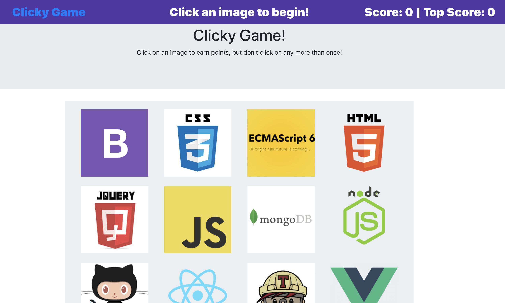

# Clicky-Game

## Overview

This application was built with React. The UI is broken up into a differnet components, manages component state, and responds to user events.

[Deployed Site](https://sheltered-gorge-46172.herokuapp.com/)

* The application will render a set of 12 images and each image should only be clicked once.

* Once an image is clicked you score will increase, after an image is selected the images will be shuffled.

* If an image is clicked more than once the game is over and your score will be set back to 0.

* A top score is stored to show the number of correct guesses in a row.

## Installation

To install the application follow the instructions below:

	git clone https://github.com/Bgosse1/Clicky-Game.git
	cd Clicky-Game
	npm install

## Running Locally

To run the application locally and access it in your browser, run

	npm run start

The application will now be running locally on port 3000. You can then access it locally from your browser at the URL `localhost:3000`.

